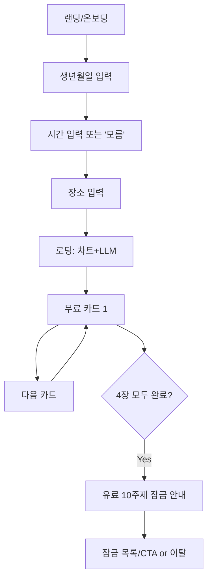
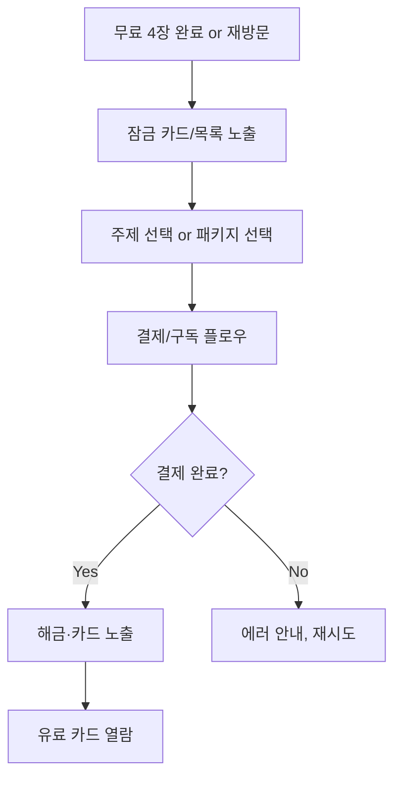
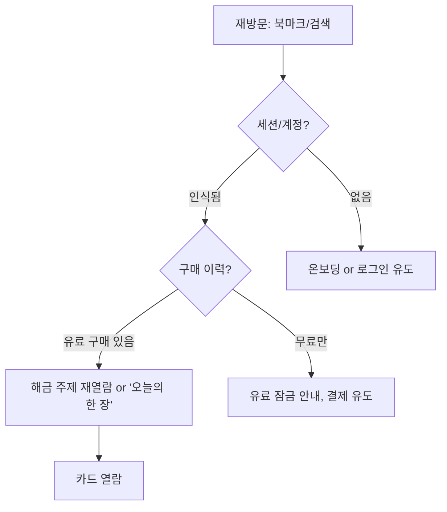
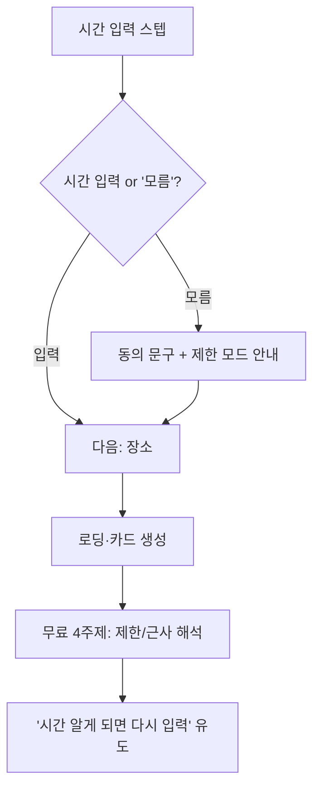

# UX Design Specification — natalchart

**Author:** daun  
**Date:** 2026-01-21

---

## Executive Summary

### Project Vision

출생(네이탈) 차트와 LLM 해석을 **한 화면에 한 주제(한 장 카드)**로 제공해, "GPT보다 나를 잘 안다"고 느끼게 하고, 궁금할 때마다 재방문·유료 전환을 만드는 웹 서비스.  
기존 운세의 긴 글·스크롤을 **한 장 = 심볼 1개 + 핵심 1~2문장 + [ 다음 카드 ]** 구조로 바꾸고, 무료 4주제로 체험·재방문, 유료 10주제로 과금.

### Target Users

- **1차:** 네이탈·운세에 관심 있는 일반 사용자. "나에 대한 말이 왜 이렇게 맞지?"가 궁금한 사람.
- **2차:** 연애·금전·직업·타이밍 등 심화 주제에 궁금함을 느끼는 사용자(유료 전환 후보).
- **컨텍스트:** 모바일 우선 사용, SNS·지인 추천으로 유입. 입력 부담에 민감(특히 "시간 모름" 허용 필요).

### Key Design Challenges

- **한 화면 한 정보·카드 경험:** 스크롤·긴 글 대신 카드 단위로 집중시키고, [ 다음 카드 ]로 이어지는 흐름을 자연스럽게 만들기.
- **무료→유료 전환 UX:** 4장 무료 후 잠금 노출 시 이탈을 줄이면서, "나중에 궁금해지면 풀어보기" 인상을 주는 균형.
- **입력 플로우 단순화:** 생년월일 → 시간 → 장소를 스텝당 한 입력으로, "시간 모름"·"대략만 알아"를 부담 없이 선택하게 하기.
- **로딩·대기 체감:** 출생차트 계산·LLM 호출 구간에서 진행 상태·로딩 UI로 기다림을 견딜 수 있게 하기.

### Design Opportunities

- **카드·가벼운 성취감:** 토스·당근·듀오처럼 "한 화면 한 정보, 카드, 가벼운 성취"를 운세 도메인에 적용해 차별화.
- **밝은·현대적 톤:** 기존 어둡고 신비로운 운세 톤 대신, 밝고 이해하기 쉬운 톤으로 접근성·재방문 의욕 확보.
- **재방문·궁금함 트리거:** "오늘의 한 장", 해금 주제 재노출, 공유 URL 등으로 "궁금할 때마다 여기" 습관 만들기.

---

## Core User Experience

### Defining Experience

**핵심 경험:** "한 장 카드를 넘기며, 나에 대한 해석을 하나씩 발견한다."

- **가장 빈번한 행동:** [ 다음 카드 ]로 한 장씩 넘기며 무료 4주제 → (유료 시) 10주제 해석 보기.
- **가장 중요한 행동:** 출생 정보(생년월일·시간·장소)를 스텝별로 입력하고, 첫 카드가 나올 때까지의 대기.
- **완전히 무리 없어야 할 것:** 스텝당 한 입력, [ 다음 카드 ] 탭/클릭, 잠금 카드에서 "해금하려면" CTA.

### Platform Strategy

- **플랫폼:** 웹 앱(Next.js SSR). **모바일 우선** 반응형. iOS Safari, Android Chrome, 데스크톱(Chrome, Safari, Edge) 최근 2버전.
- **입력 방식:** 터치·클릭 둘 다. 터치 타겟 44×44px 이상(NFR-A2). 키보드 포커스로 조작 가능(NFR-A1).
- **오프라인:** MVP 미지원. Growth에서 제한적 오프라인(캐시된 카드) 검토.

### Effortless Interactions

- **스텝당 한 입력:** 생년월일 → 시간 → 장소. "시간 모름" 선택 시 추가 조회 없이 다음 단계로.
- **카드 넘기기:** [ 다음 카드 ] 한 번에 다음 주제로. 스와이프(선택) 시 일관된 제스처.
- **잠금 인지:** 유료 주제는 자물쇠·블러 등으로 한눈에 구분, "이 카드를 보려면 해금이 필요해요" + CTA.

### Critical Success Moments

- **첫 카드 노출:** 무료 1주제 카드가 로딩 후 나타나는 순간. "맞아, 나 그렇지" 체감의 시작.
- **무료 4장 종료 시점:** 유료 10주제 잠금 안내. "나중에 궁금해지면 다시 와서 풀어보기" 인상.
- **결제 후 해금:** 유료 주제가 열리고 카드가 보이는 순간. "여기서만 이렇게 구체적으로 나온다" 체감.
- **재방문 시 해금 주제 재열람:** 구매 이력으로 바로 열람. "궁금할 때마다 여기 들어온다" 습관.

### Experience Principles

1. **한 화면, 한 초점** — 카드·입력 스텝·CTA는 스크롤 없이 한 화면에. 집중과 이탈 감소.
2. **스텝은 최소, 선택은 명확** — 입력은 스텝당 하나. "시간 모름"처럼 모호함을 허용하는 선택지를 명시.
3. **로딩은 보여준다** — 출생차트·LLM 대기 시 진행 상태·스피너·스켈레톤. NFR-P2 준수.
4. **잠금은 유도지 강요 아님** — 유료 안내는 "나중에 궁금해지면" 톤. 이탈 최소화.
5. **모바일 우선, 터치 친화** — 44px 터치, 굵은 CTA, 세로 쓰기 최적화.

---

## Desired Emotional Response

### Primary Emotional Goals

- **"나를 잘 안다" (체감 정확도)** — GPT·Gemini보다 "나에 대한 말이 더 맞다"고 느끼게. 실제 정확도보다 체감에 초점.
- **가벼운 성취·호기심** — 카드를 넘길 때마다 작은 발견. "그다음은 뭐지?"로 이어지는 호기심.
- **믿음·편안함** — 입력이 단순하고, "시간 모름"도 받아주며, 로딩을 숨기지 않아 예측 가능하게.

### Emotional Journey Mapping

| 단계                         | 감정 목표                                |
| ---------------------------- | ---------------------------------------- |
| **랜딩·첫 발견**             | 호기심, "한번 해볼까"                    |
| **입력(생년월일·시간·장소)** | 부담 없음, "간단하네"                    |
| **로딩(차트·LLM)**           | 기대, "뭔가 만들고 있구나"               |
| **무료 4장**                 | "맞다", "이렇게 보이구나", 가벼운 성취   |
| **유료 잠금 노출**           | "나중에 더 보고 싶다" rather than "굳이" |
| **결제·해금**                | "값진 구매", 구체적 해석에 대한 만족     |
| **재방문**                   | "역시 여기", 습관·의존                   |

### Micro-Emotions

- **Confidence vs. Confusion:** 스텝·카드·잠금이 명확해 혼란 최소화. "시간 모름" 선택 시 제한 안내로 기대 조절.
- **Trust vs. Skepticism:** 로딩 노출, 에러 시 `{ error, code, retry }`·재시도 옵션으로 신뢰.
- **Accomplishment vs. Frustration:** 카드 단위 완료·[ 다음 카드 ]로 성취감; 로딩·에러 시 안내·재시도로 좌절 완화.

### Design Implications

- **"나를 잘 안다"** → 한 장 포맷·톤 가이드 일관성, 무료 4주제 품질·훅 강화.
- **가벼운 성취** → 카드 전환 애니메이션, 주제 제목·심볼로 구분감, CTA 문구("다음 카드").
- **잠금·유도** → 블러·자물쇠 아이콘, "이 카드를 보려면 해금이 필요해요" + 부담 없는 CTA 문구.

### Emotional Design Principles

- 체감 정확도를 높이려면 **짧고 일관된 문장·톤**이 길고 어렵게 쓴 해석보다 유리.
- **에러·지연**은 숨기지 않고, 재시도·안내를 보여줌으로써 신뢰 유지.
- **유료 전환**은 "필요할 때" 맥락에서, 궁금한 주제를 직접 보여주며 유도.

---

## UX Pattern Analysis & Inspiration

### Inspiring Products Analysis

- **토스·당근·듀오:** 한 화면 한 정보, 카드형, 가벼운 성취, 밝은 톤. — natalchart의 "한 장 카드"·입력 단계 간소화에 참고.
- **Duolingo·Headspace:** 짧은 단위 진행, 로딩·대기 시 애니메이션·명확한 상태. — 출생차트·LLM 대기 UX 참고.
- **결제·구독 앱:** 잠금 해금, "이 콘텐츠를 보려면" 문구, CTA 명확성. — 유료 10주제 잠금·결제 플로우 참고.

### Transferable UX Patterns

- **스텝 폼:** 한 스텝에 한 입력(날짜 / 시간 / 장소). "건너뛰기"·"모름"을 명시적 선택지로.
- **카드 넘기기:** [ 다음 카드 ] 우선. (선택) 스와이프. 카드별 인덱스·진행 표시(1/4, 2/4 등).
- **잠금 카드:** 블러·자물쇠·"해금이 필요해요" + CTA. 주제 제목만 보이게 해 궁금함 유발.
- **로딩·에러:** 스피너·스켈레톤, `retry` 버튼, 짧은 안내 문구.

### Anti-Patterns to Avoid

- **긴 스크롤·한 페이지에 모든 주제:** 한 화면 한 주제 원칙 위반. 이탈·집중 저하.
- **입력 한 번에 몰아넣기:** 생년월일·시간·장소를 한 폼에 → 부담·이탈. 스텝 분리 필수.
- **"시간 필수"만 강조:** "시간 모름" 없이 막으면 이탈. 선택지 제공.
- **잠금을 강압적으로:** "지금 결제해야 한다" 위주의 다크 패턴. "나중에" 맥락 유지.

### Design Inspiration Strategy

- **도입:** 스텝 폼, 카드 넘기기, 잠금 카드, 로딩/에러 패턴 — PRD·아키텍처와 정합.
- **적응:** 카드에 **심볼 1개 + 1~2문장 + CTA** 고정 구조. 토스·당근 스타일을 운세 도메인에 맞게 톤 조정.
- **회피:** 긴 글·한 페이지 스크롤, 시간 필수 강요, 강압적 잠금 안내.

---

## Design System Foundation

### Design System Choice

- **Base UI (MUI Base)** + **Tailwind CSS.**  
  아키텍처에 명시: Base UI는 헤드리스·접근성 기반 컴포넌트(버튼, 입력, 모달 등), 스타일은 Tailwind로 적용.

### Rationale for Selection

- **Base UI:** 접근성(ARIA, 포커스)·구조·동작을 제공하고, 스타일을 Tailwind로 완전 제어. NFR-A1·A2(포커스, 44px)에 부합.
- **Tailwind:** 모바일 우선 반응형, 44px·spacing·타이포 확장 용이. create-next-app·아키텍처와 일치.

### Implementation Approach

- create-next-app 초기화 후 `@base-ui-components/react`(또는 최신 패키지명) 설치.
- `shared/ui/`에 Button, Input, Modal 등 래퍼. Tailwind 클래스로 시각·간격·반응형.
- 디자인 토큰(색, 타이포, 간격)은 Tailwind `theme` 확장으로 관리.

### Customization Strategy

- Base UI 기본 스타일 제거, Tailwind 유틸로 natalchart 톤·색·타이포 적용.
- 한 장 카드, 온보딩 스텝, 잠금 카드, [ 다음 카드 ] CTA는 **커스텀 컴포넌트**로 Design Token 기반.

---

## Defining Core Experience (상세)

### Defining Experience

**정의:** "한 장 카드를 넘기며, 나에 대한 해석을 하나씩 발견한다."  
사용자가 친구에게 설명할 만한 행동: "생일·시간·장소 넣으면, 카드로 나에 대한 해석이 나와. 무료로 4개 보고, 더 보려면 유료."

### User Mental Model

- **기대:** "운세/네이탈" → 생년월일·시간·장소 필요. "시간 모름"이 있으면 진입 장벽이 낮아진다.
- **카드:** "한 장 = 한 주제" 인지. [ 다음 카드 ]로 이어지는 흐름은 스토리/슬라이드와 유사.
- **잠금:** "일부는 돈 내야 본다"는 모델에 익숙. 블러·자물쇠로 직관적 이해.

### Success Criteria

- "이 just works": 입력 3스텝 + (시간 모름 시) 1선택으로 첫 카드까지 도달.
- "맞는 말이다": 무료 4장에서 1~2장이라도 공감. 톤·포맷 일관성.
- "다시 보고 싶다": 4장 종료 후 유료 잠금 안내에서 과한 이탈 없음.
- 카드 전환: 1초 이내(NFR-P3). 로딩: 15초 내 카드 노출 또는 진행 표시(NFR-P2).

### Novel UX Patterns

- **기존 운세 대비:** 긴 글·스크롤 → 한 장 카드. "한 화면 한 주제"는 토스·당근 등에서 차용하되, **운세·네이탈 도메인에 먼저 적용**한 조합.
- **가정 전환:** "결과는 길어야 한다" → 짧게; "시간 필수" → "시간 모름" 허용.
- **교육:** 신규 패턴 최소. 카드·[ 다음 카드 ]·잠금은 널리 쓰이는隐喻로 이해 용이.

### Experience Mechanics

| 단계         | 사용자                  | 시스템                          | 피드백                  |
| ------------ | ----------------------- | ------------------------------- | ----------------------- |
| **시작**     | 랜딩/온보딩 진입        | —                               | CTA "시작하기"          |
| **입력 1**   | 생년월일 선택/입력      | 유효성 검사                     | 다음 스텝 노출          |
| **입력 2**   | 시간 입력 또는 "모름"   | (모름 시) 기본값/제한 모드 안내 | 다음 스텝 노출          |
| **입력 3**   | 장소 입력               | —                               | "결과 보기" 등 CTA      |
| **로딩**     | 대기                    | 출생차트 계산 + LLM 호출        | 스피너·진행 문구        |
| **카드 1~4** | 심볼·문장·[ 다음 카드 ] | 무료 4주제 순차                 | 카드 전환 애니메이션    |
| **잠금**     | 잠금 카드·목록 확인     | 10주제 잠금 표시                | "해금이 필요해요" + CTA |
| **결제**     | 결제/구독 플로우        | PG·웹훅·구매 이력               | 완료 후 해금·카드 노출  |
| **재방문**   | 로그인/세션             | 구매 이력 조회                  | 해금 주제 즉시 열람     |

---

## Visual Design Foundation

### Color System

- **톤:** 밝고 현대적. 기존 운세의 어둡고 신비로운 톤 배제.
- **역할:**
    - **Primary:** CTA, [ 다음 카드 ], 해금·결제. 강조·행동 유도.
    - **Secondary:** 배경·카드 구분·보조 요소.
    - **Semantic:** Success(해금·완료), Warning(제한 모드·시간 모름), Error(에러·재시도 유도).
- **접근성:** 본문 대비 4.5:1 이상. 터치 영역·포커스 링 대비 확보.

### Typography System

- **역할:** 제목(주제명·카드 제목), 본문(핵심 1~2문장), 보조(안내·레이블).
- **특성:** 가독성 우선. 한글·숫자 균형. 모바일에서 1~2문장이 한눈에 들어오는 크기.
- **스케일:** h1/h2/body/small 등 Tailwind `fontSize` 확장. `line-height` 1.4~1.6.

### Spacing & Layout Foundation

- **기준:** 4px 또는 8px 베이스. Tailwind `space-*`, `p-*`, `gap-*`로 통일.
- **레이아웃:** 카드·입력 스텝은 **스크롤 없이 한 화면**. 상하 패딩·세이프Area 고려.
- **그리드:** 모바일 1열, 태블릿·데스크톱에서 여유 시 카드 중앙 정렬·최대 너비 제한.

### Accessibility Considerations

- **MVP:** 포커스·대비·터치 44×44px(NFR-A1, A2). `error`·`retry` 노출.
- **Growth:** WCAG 2.1 AA. 색만으로 상태 전달하지 않기, 레이블·ARIA.

---

## Design Direction Decision

### Design Directions Explored

- **A. 미니멀·카드 중심:** 여백 많고, 카드·심볼·문장만 강조. [ 다음 카드 ]가 유일한 CTA.
- **B. 가이드·진행감:** 상단에 "1/4", "2/4" 진행, 카드+보조 문구. 온보딩·잠금 안내 문구 강화.
- **C. 감성·일러스트:** 심볼을 일러스트에 가깝게, 배경 그라데이션·부드러운 톤.

### Chosen Direction

- **B(가이드·진행감)를 기본**, A의 미니멀한 카드 레이아웃을 결합.  
  진행(1/4 등)·안내 문구로 맥락을 주고, 카드 본문은 깔끔하게 유지.  
  C는 Growth에서 브랜드 강화 시 검토.

### Design Rationale

- **진행 표시:** 4장·14장 구조에서 "몇 번째인지" 알려주면 이탈 감소·성취감 보조.
- **미니멀 카드:** 한 화면 한 주제 원칙. 심볼+문장+CTA만으로 집중.
- **잠금·유료:** "해금이 필요해요" 문구·CTA를 같은 패턴으로 통일해 예측 가능하게.

### Implementation Approach

- Tailwind + Base UI. `ux-design-specification`의 색·타이포·간격 토큰을 `tailwind.config`에 반영.
- `widgets/card-viewer`, `widgets/onboarding-steps`, `widgets/locked-topic-list`에서 레이아웃·진행·잠금 패턴 적용.
- (선택) `ux-color-themes.html`, `ux-design-directions.html`로 팀 검토용 시각화.

---

## User Journey Flows

### 여정 1: 첫 방문 — 무료 4주제로 "나를 잘 안다" 체감

- **진입:** 랜딩 또는 `/onboarding`. "시작하기" CTA.
- **성공:** 4장에서 "맞아, 나 그렇지" 체감. 이탈 없이 잠금 안내까지 도달.
- **회복:** 입력 오류 시 필드 레이블·에러 문구. 로딩 실패 시 `retry`·안내.

### 여정 2: 유료 전환 — 잠금 주제를 보고 결제

- **진입:** 잠금 카드의 "해금이 필요해요" + CTA. 또는 잠금 목록에서 주제/패키지 선택.
- **성공:** 결제 완료 → 웹훅·구매 이력 → 해당 주제 해금 → 카드 노출.
- **회복:** PG 장애 시 NFR-I2: 안내·재시도 경로.

### 여정 3: 재방문 — 궁금할 때마다 다시 들어옴

- **성공:** 구매 이력으로 해금 주제 즉시 열람. "궁금할 때마다 여기" 습관.
- **분기:** 무료만 사용 시 잠금 안내·결제 유도. 톤은 "나중에" 위주.

### 여정 4: "시간 모를 때" 입력

- **성공:** 이탈 없이 무료 4주제까지 제한 모드로 제공. "대충은 느껴진다" 수준.
- **회복:** "시간 모름" 선택 시 제한 안내로 기대 조절. Growth에서 "나중에 시간 보완" 플로우 검토.

### Journey Patterns

- **네비게이션:** 스텝(온보딩)·카드 인덱스([ 다음 카드 ])·잠금(목록 or 카드)에서 동일 CTA 스타일.
- **피드백:** 로딩(스피너/진행), 에러(`error`+`retry`), 완료(해금·카드 노출)를 같은 패턴으로.
- **분기:** 무료/유료, 시간 유/무, 구매 유/무에 따라 안내 문구·CTA만 교체, 레이아웃은 유지.

### Flow Optimization Principles

- **가치까지 단계 최소화:** 랜딩 → 입력 3스텝 → 첫 카드. 중간 페이지·폼 필드 최소.
- **결정 부담 감소:** 스텝당 한 입력, "모름" 명시, 잠금은 "나중에" 맥락.
- **에러·지연:** 재시도·안내를 숨기지 않음. NFR-I1·I2 반영.

---

## Component Strategy

### Design System Components (Base UI + Tailwind)

- **Button:** [ 다음 카드 ], CTA(해금·결제·시작하기), 보조(뒤로·재시도). variant: primary / secondary / ghost.
- **Input:** 날짜, 시간, 텍스트(장소). 라벨·에러·`aria-*` 적용.
- **Modal/Dialog:** 확인(시간 모름 동의), 결제·에러 안내. 포커스 트랩·ESC.
- **Tabs:** (선택) 주제 목록·잠금 목록. MVP에서는 카드·목록 위주.

### Custom Components

#### 1. NatalCard (한 장 카드)

- **역할:** 심볼 1개 + 해당 주제 해석(핵심 1~2문장) + [ 다음 카드 ] CTA.
- **구성:** `symbol`(이미지/아이콘), `title`(주제명), `body`(1~2문장), `cta`(다음 카드 or 해금 CTA).
- **상태:** default, loading(스켈레톤), locked(블러·자물쇠·해금 CTA).
- **접근성:** `role="article"` 또는 `region`, `aria-label`로 주제명·"다음 카드" CTA.

#### 2. OnboardingStep

- **역할:** 생년월일 / 시간 / 장소 중 한 스텝. 스텝당 한 입력.
- **구성:** 제목·입력(날짜 피커, 시간 입력, "모름" 체크, 장소 텍스트)·다음/이전.
- **상태:** default, error(필드별), loading(제출 후).
- **접근성:** `fieldset`·`legend`, `aria-invalid`, `aria-describedby`(에러).

#### 3. LockedTopicCard / LockedTopicList

- **역할:** 유료 주제 잠금. 카드형(블러·자물쇠) 또는 목록형. "해금이 필요해요" + CTA.
- **구성:** 주제명(선택), 자물쇠·블러, 문구, CTA(해금·결제).
- **상태:** locked. (해금 시 NatalCard로 전환.)
- **접근성:** "잠금", "해금하려면 결제가 필요합니다" 등 `aria-label`.

#### 4. ProgressIndicator (선택)

- **역할:** "1/4", "2/4" 등 카드·스텝 진행.
- **구성:** 현재/전체 숫자 또는 도트·바.
- **상태:** 온보딩 스텝, 카드 인덱스.

#### 5. LoadingCard / ChartLoading

- **역할:** 출생차트·LLM 대기. NFR-P2.
- **구성:** 스피너·진행 문구("해석을 만들고 있어요" 등). 스켈레톤(카드 형태) 선택.

### Component Implementation Strategy

- Base UI로 구조·접근성, Tailwind로 시각. `shared/ui/` 래퍼는 Base UI 기반.
- `NatalCard`, `OnboardingStep`, `LockedTopicCard`는 `entities/*`, `widgets/*`에서 사용. `shared`는 의존하지 않음(FSD).
- 상태: URL(카드 인덱스·스텝) + 서버 fetch. 로딩·에러는 `loading.tsx`, `error.tsx`와 `ErrorBoundary`로.

### Implementation Roadmap

| 단계        | 컴포넌트                                     | 용도               |
| ----------- | -------------------------------------------- | ------------------ |
| **Phase 1** | OnboardingStep, NatalCard, [ 다음 카드 ] CTA | 첫 방문·무료 4장   |
| **Phase 1** | LockedTopicCard / List, 결제 CTA             | 유료 잠금·전환     |
| **Phase 1** | ChartLoading, LoadingCard, 에러·retry UI     | 로딩·NFR-P2, I1·I2 |
| **Phase 2** | ProgressIndicator, "오늘의 한 장"            | 재방문·진행감      |
| **Phase 2** | 공유·OG, (선택) 스와이프                     | Growth             |

---

## UX Consistency Patterns

### Button Hierarchy

- **Primary:** [ 다음 카드 ], "시작하기", "해금하기", "결제하기". 한 화면에 하나 우선. 색·크기로 강조.
- **Secondary:** "이전", "나중에", "다른 주제 보기". Primary 보조.
- **Ghost/Text:** "시간 모름", "재시도", 링크형. 덜 강조.

### Feedback Patterns

- **Success:** 해금·결제 완료 → 짧은 토스트/인라인 + 다음 화면(카드 노출).
- **Error:** `{ error, retry }` → 인라인 메시지 + "다시 시도" 버튼. NFR-I1·I2.
- **Loading:** 스피너·스켈레톤·진행 문구. 버튼 비활성화(중복 제출 방지).
- **Warning:** "시간 모름" 제한 모드 안내. Semantic Warning 색·아이콘.

### Form Patterns

- **스텝당 한 입력.** 라벨·placeholder·에러는 필드 인접. `aria-invalid`, `aria-describedby`.
- **"모름"·"건너뛰기"**는 체크박스·라디오로 명시. 선택 시 보조 안내 노출.
- **제출:** 로딩 중 버튼 비활성·로딩 표시. 에러 시 폼 상단 요약(선택) + 필드별 에러.

### Navigation Patterns

- **온보딩:** 이전/다음. 이전 시 데이터 유지.
- **카드:** [ 다음 카드 ] only. (선택) 스와이프. 인덱스는 ProgressIndicator.
- **잠금:** 목록에서 주제 선택 → 결제 or 잠금 카드에서 CTA.
- **전역:** 헤더 로그인/계정. 랜딩·온보딩·카드·결제 간 이동은 CTA·흐름에 따름.

### Additional Patterns

- **Empty:** 카드 없음(에러·재시도), 구매 이력 없음(잠금 유도). 문구 + CTA.
- **Modal:** 확인(시간 모름 동의), 결제·에러. 배경 블러·포커스 트랩·ESC.
- **목록·카드:** 잠금 목록은 카드 그리드 또는 리스트. 터치 44px, 클릭 영역 명확.

---

## Responsive Design & Accessibility

### Responsive Strategy

- **모바일 우선.** 320px~767px 기준. 카드·입력·CTA는 스크롤 없이 한 화면.
- **태블릿 768~1023px:** 동일 레이아웃, 터치 타겟·간격 유지. 카드 최대 너비로 가독성.
- **데스크톱 1024px+:** 카드·폼 중앙 정렬, 최대 너비(예: 480px)로 한 줄 가독성.

### Breakpoint Strategy

- **Tailwind 기본 + 필요 시 확장:**  
  `sm:640`, `md:768`, `lg:1024`, `xl:1280`.
- **카드·입력:** 모바일 1열. 데스크톱에서도 카드는 1장씩(한 화면 한 주제 유지).

### Accessibility Strategy

- **MVP:**
    - 키보드 포커스(NFR-A1): 입력·버튼·카드 CTA.
    - 터치 44×44px(NFR-A2).
    - 대비: 본문 4.5:1.
    - `error`·`retry` 노출(NFR-I1·I2).
- **Growth:** WCAG 2.1 AA. ARIA·스크린 리더, 색 외 시각적 구분.

### Testing Strategy

- **반응형:** Chrome DevTools, iOS Safari·Android Chrome 실제 기기. 320, 375, 768, 1024.
- **접근성:**
    - 키보드만으로 온보딩·카드·결제 CTA 조작.
    - axe·Lighthouse a11y.
    - (Growth) VoiceOver·TalkBack.

### Implementation Guidelines

- **단위:** `rem`·`%`·`vw/vh` 우선. `px`는 44px 터치 등 고정 필요 시만.
- **포커스:** `focus-visible:ring-2` 등. Base UI 기본 포커스 활용.
- **시맨틱:** `main`, `article`, `button`, `label`, `fieldset`/`legend`.
- **ARIA:** `aria-label`, `aria-live`(로딩·에러), `aria-busy`(로딩).

---

## Document Metadata & Handoff

### Specification Status

- **Workflow:** create-ux-design
- **Steps completed:** 1–14
- **Inputs:** `prd.md`, `architecture.md`
- **Output:** `_bmad-output/planning-artifacts/ux-design-specification.md`

### Design–Implementation Mapping

| UX 문서 섹션                              | 아키텍처/구현                                                      |
| ----------------------------------------- | ------------------------------------------------------------------ |
| Core User Experience, Defining Experience | `widgets/card-viewer`, `features/cards`, `entities/card`           |
| OnboardingStep, 스텝 입력                 | `widgets/onboarding-steps`, `features/onboarding`                  |
| LockedTopicCard/List, 잠금                | `widgets/locked-topic-list`, `features/access`, `features/payment` |
| NatalCard, 한 장 카드                     | `entities/card`, `widgets/card-viewer`                             |
| Loading, Error, retry                     | `loading.tsx`, `error.tsx`, `{ error, code, retry }`               |
| Visual Foundation, Design Direction       | `tailwind.config`, `shared/ui`, Design Tokens                      |
| Responsive & Accessibility                | NFR-A1·A2, breakpoints, 터치 44px                                  |

### Next Steps

1. **Create Epics and Stories:** 이 UX 문서를 입력에 포함해, 프론트·위젯·플로우 단위 에픽/스토리 생성.
2. **와이어프레임:** 카드·온보딩·잠금 화면 저 fidelity.
3. **시각 디자인:** 색·타이포·컴포넌트 high-fi. (선택) `ux-color-themes.html`, `ux-design-directions.html` 확장.

---

**UX Design Specification for natalchart — Ready for Epics & Implementation** ✅
